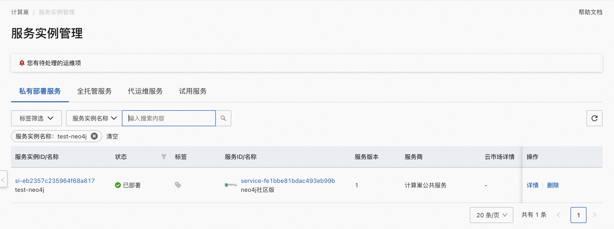

## 概述
Neo4j是一个嵌入式的、基于磁盘的、具备完全的事务特性的Java持久化引擎。Neo4j在计算巢上提供了社区版服务，您无需自行配置云主机，即可在计算巢上快速部署Neo4j服务、实现运维监控，从而方便地基于Neo4j搭建您自己的应用。本文向您介绍如何开通计算巢上的Neo4j社区版服务，以及部署流程和使用说明。
## 计费说明
Neo4j社区版在计算巢上的费用主要涉及：

- 所选vCPU与内存规格
- 磁盘容量
- 公网带宽

计费方式包括：

- 按量付费（小时）
- 包年包月

预估费用在创建实例时可实时看到。

## 部署架构
Neo4j采用单机部署的架构。

## RAM账号所需权限
Neo4j服务需要对ECS、VPC等资源进行访问和创建操作，若您使用RAM用户创建服务实例，需要在创建服务实例前，对使用的RAM用户的账号添加相应资源的权限。添加RAM权限的详细操作，请参见[为RAM用户授权](https://help.aliyun.com/document_detail/121945.html)。所需权限如下表所示。

| 权限策略名称 | 备注 |
| --- | --- |
| AliyunECSFullAccess | 管理云服务器服务（ECS）的权限 |
| AliyunVPCFullAccess | 管理专有网络（VPC）的权限 |
| AliyunROSFullAccess | 管理资源编排服务（ROS）的权限 |
| AliyunComputeNestUserFullAccess | 管理计算巢服务（ComputeNest）的用户侧权限 |
| AliyunCloudMonitorFullAccess | 管理云监控（CloudMonitor）的权限 |

## 部署流程
### 部署步骤
单击[部署链接](https://computenest.console.aliyun.com/user/cn-hangzhou/serviceInstanceCreate?ServiceId=service-fe1bbe81bdac493eb99b)，进入服务实例部署界面，根据界面提示，填写参数完成部署。

 
### 验证结果

1. 查看服务实例。
服务实例创建成功后，部署时间大约需要2分钟。部署完成后，页面上可以看到对应的服务实例。 

    

2. 通过服务实例访问Neo4j, 可以在服务实例详情页获取到PublicEndpoint、PrivateEndpoint和InstallPath。

    

***注意:***

    ECS安全组默认开放 7474 端口，如果您要通过公网从浏览器连接数据库，需要您主动打开安全组 7687 端口。
