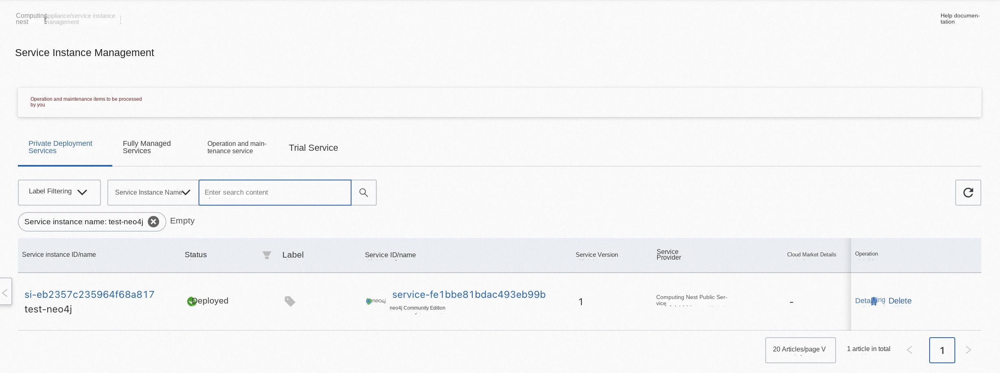

## Overview
Neo4j is an embedded, disk-based, fully transactional Java persistence engine. Neo4j provides a community version of the service on the computing nest. You can quickly deploy the Neo4j service on the computing nest and implement O & M monitoring without configuring your own cloud host, so that you can easily build your own applications based on Neo4j. This topic describes how to activate the Neo4j Community Edition service on the computing nest, as well as the deployment process and usage instructions.
## Billing Description
The cost of Neo4j Community Edition on computing nests mainly involves:

-Selected vCPU and memory specifications
-Disk Capacity
-public network bandwidth

Billing methods include:

-Pay-As-You-Go (hours)
-Package year and package month

The estimated cost can be seen in real time when the instance is created.

## Deployment Architecture
Neo4j uses a stand-alone deployment architecture.

## Permissions required for RAM accounts
The Neo4j service needs to access and create resources such as ECS and VPC. If you use a RAM user to create a service instance, you need to add the corresponding resource permissions to the account of the RAM user before creating the service instance. For details about how to add RAM permissions, see [Authorize RAM users](https://help.aliyun.com/document_detail/121945.html). The required permissions are shown in the following table.

| Permission policy name | Comment |
| --- | --- |
| AliyunECSFullAccess | Permissions to manage ECS instances |
| AliyunVPCFullAccess | Permissions to manage a VPC |
| AliyunROSFullAccess | Manage permissions for Resource Orchestration Service (ROS) |
| AliyunComputeNestUserFullAccess | Manage user-side permissions for the compute nest service (ComputeNest) |
| AliyunCloudMonitorFullAccess | Permissions to manage CloudMonitor (CloudMonitor) |

## Deployment process
### Deployment steps
Click [Deployment Link](https://computenest.console.aliyun.com/user/cn-hangzhou/serviceInstanceCreate?ServiceId=service-fe1bbe81bdac493eb99b) to enter the service instance deployment page, and fill in the parameters according to the interface prompts to complete the deployment.

### Validation Results

1. View the service instance.
After the service instance is created successfully, the deployment time takes about 2 minutes. After the deployment is complete, the corresponding service instance is displayed on the page.

2. To access Neo4j through a service instance, you can obtain the PublicEndpoint, PrivateEndpoint, and InstallPath on the service instance details page.

*** NOTE: ***

By default, the 7474 port of an ECS security group is open. If you want to connect to the database from a browser through the Internet, you need to open the port 7687 the security group.
